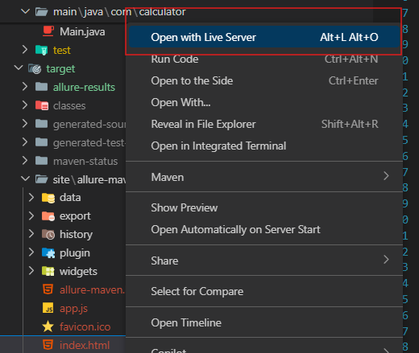

# Calculator Application

## Author
- Aryo Rakatama (221524003)
- Muhamad Mathar Rizqi (221524014)
- Muhammad Rama Nurimani (221524021)

## Overview
This project is a software under test include its unit testing for Software Testing Course in JTK POLBAN, it is simple calculator application built in Java. It provides basic arithmetic operations such as addition, subtraction, multiplication, and division. 

## Features
- Addition, subtraction, multiplication, and division operations. 
- Input within structure `number number operator`
- Input validation to ensure numbers are within a valid range.
- Error handling for invalid inputs and division by zero.
- Interactive console-based user interface.

## Project Structure
```
├── pom.xml                # Maven configuration file
├── README.md              # Project documentation
├── src/                   # Source code directory
│   ├── main/              # Main application source code
│   │   ├── java/          # Java source files
│   ├── test/              # Test source code
│   │   ├── java/          # Java test files
│   │   ├── resources/     # Test resources
├── target/                # Compiled output and build artifacts
│   ├── allure-results/    # Allure test results in JSON format
│   ├── classes/           # Compiled class files
│   ├── generated-sources/ # Generated sources (if any)
│   │   ├── annotations/   # Annotation processing output
│   ├── generated-test-sources/ # Generated test sources
│   │   ├── test-annotations/ # Test annotation processing output
│   ├── maven-status/      # Maven build status
│   ├── site/              # Maven site reports
│   ├── surefire-reports/  # Test reports
│   ├── test-classes/      # Compiled test class files
```

## How to Run Tests and View Allure Reports

### Prerequisites
Make sure the following are installed on your system:
- We use Java 21. For more you can download it here [Java Official Website](https://www.java.com/)
- Apache Maven 3.9.9 you can download it here [Maven Official Website](https://maven.apache.org/)

### Steps

1. **Clone the Repository**
   ```bash
   git clone https://github.com/muhammadrama19/ppl-unit-testing.git
   ```

2. **Navigate to the Project Directory**
   ```bash
   cd ppl-unit-testing
   ```

3. **Clean Up the target folder in case it cached during next test:**
   This command will clean all target folder.
   ```bash
   mvn clean
   ```

4. **Run the Tests**
   This command will execute the JUnit 5 tests.
   ```bash
   mvn test
   ```

5. **Generate the Allure Report**
   After running the tests, generate the Allure HTML report:
   ```bash
   mvn allure:report
   ```

6. **Open the Report Manually**
   After the report is generated, open the following file in a browser:
   ```
   target/site/allure-maven-plugin/index.html
   ```

   - **If you're using Visual Studio Code**, right-click on `index.html` and select **"Open with Live Server"** as shown below:

     

7. **Alternative: Serve the Report Automatically**
   Use this command to open the report in your default browser automatically. Note that this method does **not** create a physical `index.html` file:
   ```bash
   mvn allure:serve
   ```
`

## Test Information

| No. | Nama Class          | Nama Method         | Jumlah Test Case |
| --- | ------------------- | ------------------- | ---------------- |
| 1   | Calculator          | add                 | 4                |
|     |                     | subtract            | 4                |
|     |                     | divide              | 6                |
|     |                     | multiply            | 5                |
|     |                     | calculate           | 5                |
| 2   | Display             | displayMenu         | 1                |
|     |                     | displayHeader       | 1                |
|     |                     | getOperator         | 5                |
|     |                     | Input               | 9                |
| 3   | Validator           | isNumberValid       | 9                |
|     |                     | isValidOperator     | 5                |
|     |                     | isNotDividedByZero  | 6                |
| 4   | Helper              | stringToDouble      | 10               |

**Total:** 70 Test case


## Test Result
- This generated by Allure for reporting:
.jpg)


## Dependencies
This project uses the following dependencies:
- JUnit 5 for unit testing.
- Allure for reporting
- Maven for Build Tools